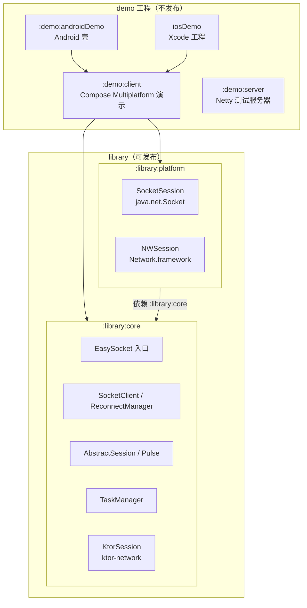
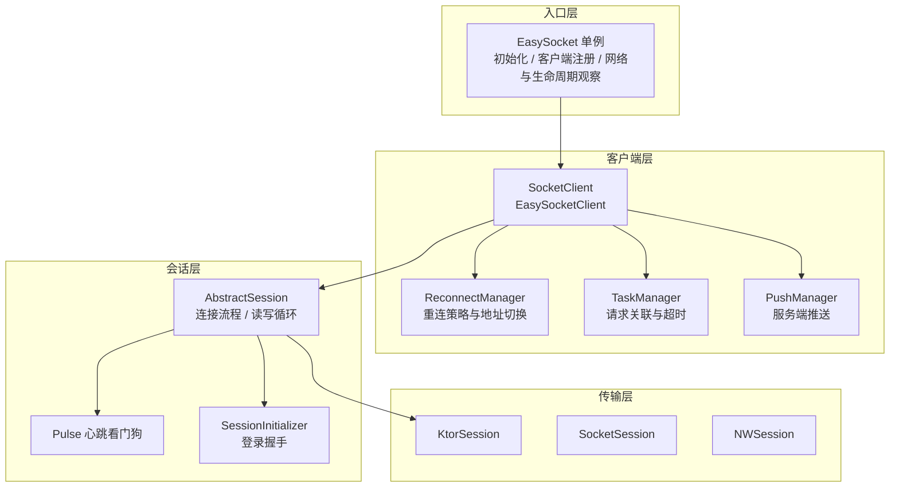
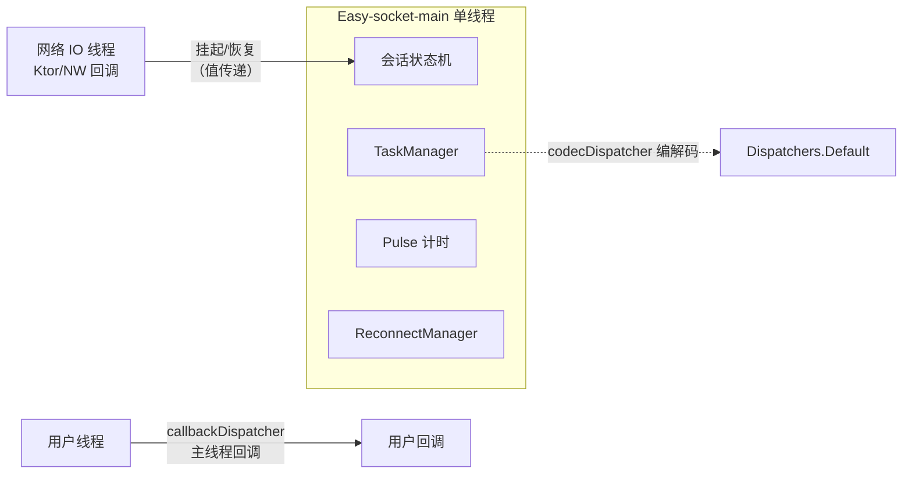
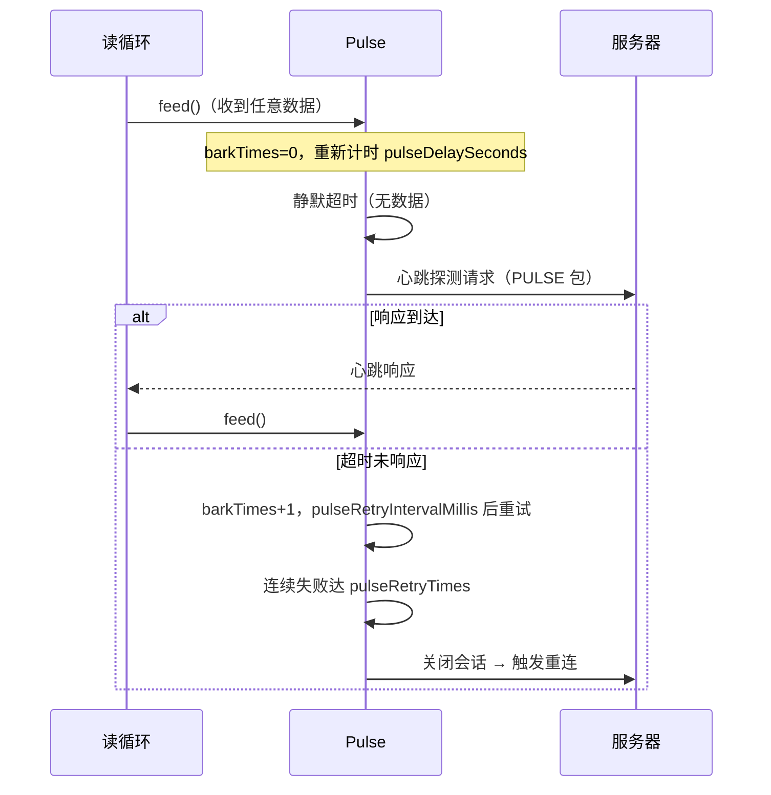
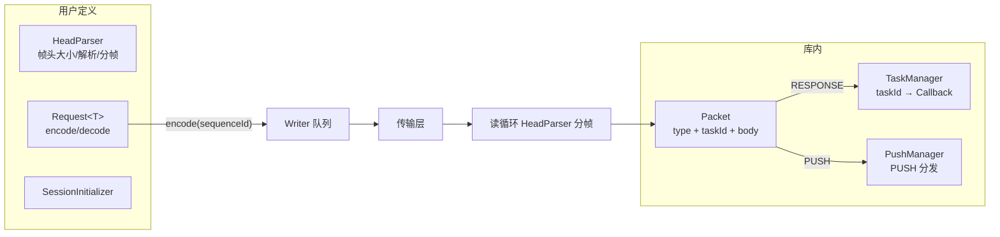

# EasySocket 架构设计

> 本文档描述 EasySocket（`ktor` 分支）的模块分层、线程模型与核心机制设计。

## 1. 总体架构

库分为两个可发布模块，各自职责单一：

| 模块 | 坐标 | 职责 |
|------|------|------|
| `:library:core` | `com.orientsec.easysocket:core` | 协议解析、任务系统、心跳、重连、会话生命周期，以及基于 Ktor 的跨平台传输 |
| `:library:platform` | `com.orientsec.easysocket:platform` | 原生平台传输：Android/JVM 的 `java.net.Socket`、iOS 的 `Network.framework` |

依赖方向为 platform → core。使用方只需 `useSocketDefaults()` 或 `useKtorDefaults()`
选择传输引擎，其余 API 完全一致。

## 2. core 内部分层

### 2.1 入口层 —— `EasySocket`

进程级单例（`EasySocket.kt`）：

- `initialize(networkObserver, lifecycleObserver)`：注入平台网络观察者与应用前后台观察者
- `open(options)`：创建 `SocketClient` 实例并注册
- 持有**库级单线程调度器** `Easy-socket-main`（见 §3）
- 维护后台时间戳（`getBackgroundTimestamp()`），供 `ReconnectPolicy.ACTIVE` 判断
- 网络恢复时广播给所有无会话的客户端，触发重连

### 2.2 客户端层 —— `SocketClient` / `ReconnectManager`

`EasySocketClient` 持有一个客户端的全部状态：

- 生命周期：`start()` / `stop()` / `shutdown()`；`ConnectionListener` 回调
  连接事件（onConnecting → onConnected → onAvailable（登录完成）→ onDisconnected）
- `ReconnectManager` 根据 `ReconnectPolicy`（NONE / ACTIVE / ALWAYS）决定是否重连：
  - ACTIVE 模式结合后台时间戳——后台超过 `backgroundActiveDurationSeconds` 则不再重连
  - 每个地址重试 `retryTimesPerAddress` 次后切换下一个地址（failover）
  - 重连间隔由 `connectIntervalMillis` 控制
- `TaskManager`：请求/响应按 `taskId` 关联，超时由 `requestTimeoutMills` 控制，
  连接不可用时任务可排队重试（`taskRetryTimes`）

### 2.3 会话层 —— `AbstractSession` / `Pulse`

`AbstractSession` 定义连接的通用流程：

1. `performConnect()`：DNS → TCP → TLS 三阶段连接（各阶段计时写入 `connectTimeMap`，
   对应 `Period.DNS / CONNECT / SSL / ALL`）
2. 连接成功后执行 `SessionInitializer.start()`（登录握手），成功后进入 AVAILABLE 状态
   并触发 `onAvailable`
3. 启动读循环（`LoopReader` 驱动 `HeadParser` 分帧）与写循环（`QueuedWriter`）
4. `Pulse` 心跳看门狗（见 §4）

### 2.4 传输层 —— 三种 Session 实现

| 实现 | 模块 | 平台 | 特点 |
|------|------|------|------|
| `KtorSession` | core | 全平台（JVM/Android/iOS） | 基于 `ktor-network`，SSL 开箱即用 |
| `SocketSession` | platform（jvmCommonMain） | Android / JVM | `java.net.Socket`；SSL 需注入 `SocketSessionFactory(SSLSocketFactory)`；读为阻塞式，关闭 socket 解除 read 阻塞 |
| `NWSession` | platform（iosMain） | iOS | `Network.framework`；`nw_connection_send/receive` 回调封装为挂起函数；`nw_content_context` 替代默认 message context（规避 K/N 对 void 返回 block 常量的互操作崩溃） |

传输层只负责“字节流的建立与收发”，不含任何业务语义；协议解析统一由 core 的
`HeadParser` 完成。

## 3. 线程模型 —— 单线程内核

**全部会话与客户端状态只在一个调度器上读写**：`EasySocket` 创建的
`Easy-socket-main` 单线程调度器。

设计收益：

- **无锁**：会话状态（连接对象、读写器、心跳计时）无跨线程可见性问题，普通 `var` 即可
- **协程取消即清理**：会话协程取消时，传输层的 `suspendCancellableCoroutine`
  以 `tryResume` 安全恢复（处理已取消的 continuation）
- **回调线程明确**：用户回调统一经 `callbackDispatcher`（默认平台主线程）派发；
  编解码经 `codecDispatcher`（默认 `Dispatchers.Default`）

## 4. 心跳 —— 看门狗模式

`Pulse` 不使用固定间隔定时器，而是看门狗：

- 有业务数据时不发心跳（`feed` 重置计时），减少无效流量
- 探测失败后以更短的 `pulseRetryIntervalMillis` 密集重试，尽快发现死链
- 心跳请求/响应由使用方通过 `pulseRequestProvider` / `pulseDecoderProvider` 定制

## 5. 协议与任务系统

- `Request.encode(sequenceId)`：`sequenceId` 即 taskId，写入帧头用于响应关联
- `PacketType` 区分 RESPONSE / PULSE / PUSH，`PacketHandler` 按类型分发
- `TaskType` 区分普通请求（REQUEST）与初始化请求（INITIALIZE）：初始化请求在连接
  建立后立即执行（如登录），普通请求在连接可用前进入等待状态

## 6. 错误体系

`EasyException` 携带三元组：

- `ErrorCode`：细粒度错误码（DNS_ANALYZE / SOCKET_CONNECT / SOCKET_CONNECT_TIMEOUT /
  TLS_ERROR / TLS_TIMEOUT / PULSE / …）
- `ErrorType`：错误类别常量——SYSTEM（主动断开，如后台超时/显式 shutdown）、
  CONNECT（连接类错误，通常导致连接终止）、TASK（任务无响应，如超时）
- `suffix`：连接标识，便于日志定位

连接过程各阶段（DNS/TCP/TLS）失败都会归因到对应 ErrorCode，而非笼统的连接失败。

## 7. 构建与发布

- Gradle 9.6 + AGP 9.4 + Kotlin 2.4.10；JDK 由 foojay-resolver-convention 按需供给
- Android 库使用 `com.android.kotlin.multiplatform.library` 插件（AGP 9 KMP 新插件）
- `settings.gradle.kts` 用嵌套 include 组织两层：
  `:library:core` / `:library:platform` 与 `:demo:client` / `:demo:androidDemo` / `:demo:server`
- 发布（vanniktech 插件）：`com.orientsec.easysocket:core` / `:platform`，
  每个坐标覆盖 KMP 根 + Android（AAR）+ JVM + iOS（klib）各 target
- JitPack 经 `jitpack.yml` 执行 `./gradlew publishToMavenLocal`

## 8. 已知设计取舍

| 取舍 | 理由 |
|------|------|
| iOS TLS 走 `nw_parameters` secure_tcp DEFAULT_CONFIGURATION | 自定义证书/双向认证暂未暴露入口 |
| JVM `NetworkObserver` 恒返回 true | JVM 无系统网络状态 API；需要时由使用方注入 |
| JVM 无 GUI 时 `mainDispatcher` 回退到 `Dispatchers.Default` | 无 Swing/JavaFX coroutines 模块时 `Dispatchers.Main` 抛异常 |
| Android 库不再合并 manifest | AGP 9 KMP 库插件不支持；`ACCESS_NETWORK_STATE` 需使用方自行声明 |
